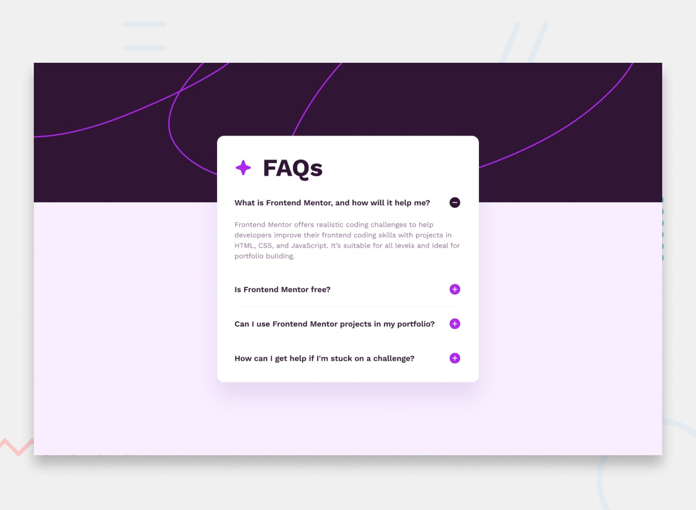

# Frontend Mentor - FAQ accordion solution

This is a solution to the [FAQ accordion challenge on Frontend Mentor](https://www.frontendmentor.io/challenges/faq-accordion-wyfFdeBwBz). Frontend Mentor challenges help you improve your coding skills by building realistic projects. 

## Table of contents

- [Overview](#overview)
  - [The challenge](#the-challenge)
  - [Screenshot](#screenshot)
  - [Links](#links)
- [My process](#my-process)
  - [Built with](#built-with)
  - [What I learned](#what-i-learned)
  - [Continued development](#continued-development)
  - [Useful resources](#useful-resources)
- [Author](#author)

## Overview

### The challenge

Users should be able to:

- Hide/Show the answer to a question when the question is clicked
- Navigate the questions and hide/show answers using keyboard navigation alone
- View the optimal layout for the interface depending on their device's screen size
- See hover and focus states for all interactive elements on the page

### Screenshot

### Links

- Solution URL: [Solution Frontend Mentor](https://www.frontendmentor.io/solutions/responsive-faq-accordion-with-details-animation-JmWMDNnbaJ)
- Live Site URL: [Live Site](https://titodelux.github.io/faqAccordion-FM/)

## My process

### Built with

- Semantic HTML5 markup
- CSS custom properties
- Flexbox
- Mobile-first workflow

### What I learned

I learned a lot about the Details element, both how to use it and make it possible for only one to be displayed in the accordion at a time, to how to stylize it and even animate it. I also put into practice the CSS "Clamp()" property to be able to have better responsiveness to all devices.

### Continued development

Crear una sombra alrededor de main, usa el elemento header para hacer mas semántico la web, para reemplazarlo con el div

### Useful resources

- [How To Styling Details Element](https://css-tricks.com/two-issues-styling-the-details-element-and-how-to-solve-them/) - This particular blog helped me a lot in understanding how to style the Details element.

## Author

- Frontend Mentor - [@Titodelux](https://www.frontendmentor.io/profile/Titodelux)
